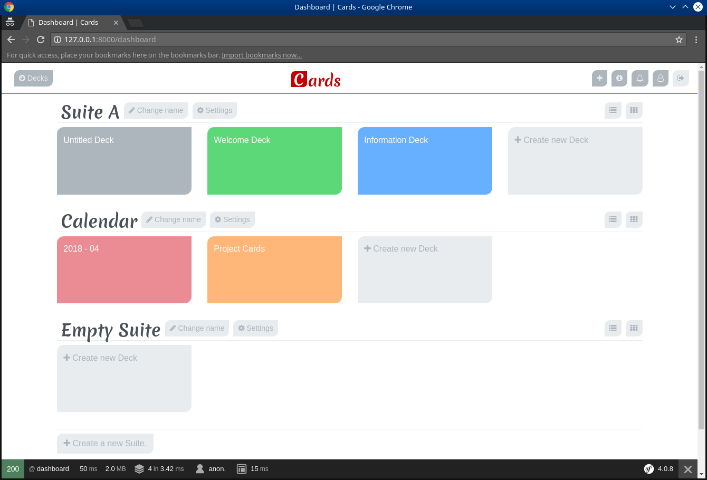
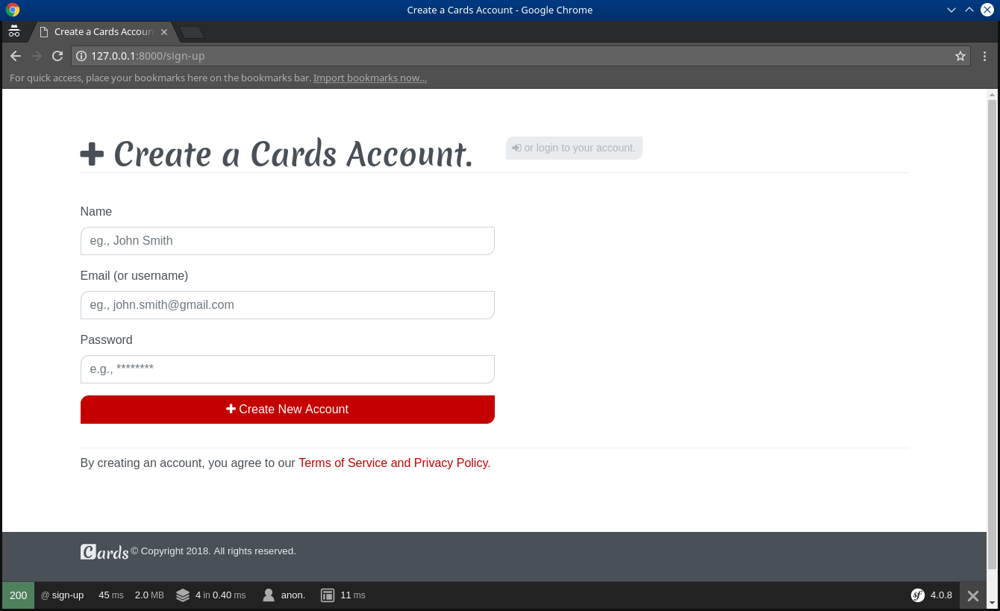
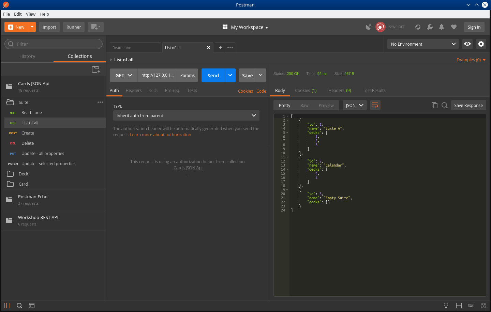

# Project Cards - (... Work In Progress)

- Website for speed up learning process,
- `Backend` - JSON Api, PHP and Symfony 4,
- `Client` - JavaScript and Vue.js.

---

## Technologies used.

List of tools (selected) used to build this project.

- [`Composer`](https://getcomposer.org/) - Dependency Manager for PHP,
- [`Symfony 4`](https://symfony.com/4) - PHP framework to create websites and web applications,
	- other bundles for PHP and Symfony: `Doctrine`, `Twig`, `Webpack Encore`, see more in file `composer.json`,
- [`Behat`](http://behat.org/en/latest/) - Behavior-Driven Development framework for PHP,
- [`Mink`](http://mink.behat.org/en/latest/) - Mink is an open source browser controller/emulator for web applications,
- [`PhpSpec`](https://www.phpspec.net/en/stable/) - a php toolset to drive emergent design by specification,
- [`PHP Coding Standard Fixer`](https://cs.sensiolabs.org/) - a tool to automatically fix PHP coding standards issues,
- [`PHP_CodeSniffer`](https://github.com/squizlabs/PHP_CodeSniffer) - tokenizes PHP, JavaScript and CSS files and detects violations of a defined set of coding standards,
- [`Yarn`](https://yarnpkg.com) - dependency management for [`node.js`](https://nodejs.org) the JavaScript runtime,
- [`Webpack Encore`](https://symfony.com/doc/current/frontend.html) - is a simpler way to integrate Webpack into application,
- [`Vue.js`](https://vuejs.org/) - A progressive, incrementally-adoptable JavaScript framework for building UI on the web,
- [`Axios`](https://github.com/axios/axios) - Promise based HTTP client for the browser and node.js,
- [`Bootstrap 4`](https://getbootstrap.com/) - `HTML` and `CSS` front-end framework for build responsive, mobile-first projects, 
    - without JavaScript libraries `jquery` and `popper.js`,
- [`Sass`](https://sass-lang.com/) - syntactically awesome style sheets, preprocessor for `CSS`,
- [`Font Awesome 4.7`](https://fontawesome.com/v4.7.0/) - scalable vector icons,
- [`Merienda One`](https://fonts.google.com/specimen/Merienda+One) - custom Google font,
- [`Git`](https://git-scm.com/) - version control system,
- [`GNU Make`](https://www.gnu.org/software/make/) - build automation tool,
- [`PhpStorm`](https://www.jetbrains.com/phpstorm/) - Lightning-smart PHP IDE,
- [`Postman`](https://www.getpostman.com/) - app makes API development faster, easier, and better,
- [`DBeaver`](https://dbeaver.io/) - Universal SQL Client,
- [`Gravit Designer`](https://www.designer.io/) -  cross-platform vector design app,
- [`SVG`](https://www.w3schools.com/graphics/svg_intro.asp) - stands for Scalable Vector Graphics,
- `Firefox` and `Chrome` - web browsers,
- [`Kubuntu`](https://kubuntu.org/) - operating system.

---

## Screenshots.

1 | 2 | 3
------|------|------
 |  | 

---
